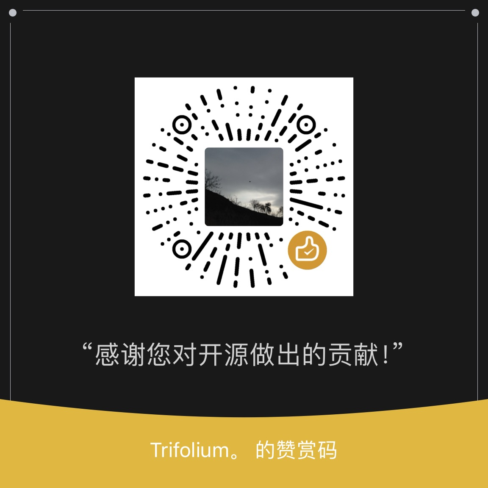

tutu-cache 是一个简单易用的Spring缓存注解。
<br/>
使用tutu-cache注解来代替@Cacheable和@CacheEvict等注解

[](https://github.com/tri5m/tutu-cache/blob/master/LICENSE)
[](https://github.com/tri5m/tutu-cache/releases/tag/1.0.4.RELEASE)

### Version
* 1.0.4.RELEASE
* 1.0.3.RELEASE
* 1.0.2.RELEASE
* 1.0.1.RELEASE
* 1.0.0

### 🥳Quick Start
1. 在springBoot中的使用
    * 引入jar依赖包
      ```xml
      <dependencies>
        <dependency>
            <groupId>io.github.tri5m</groupId>
            <artifactId>tucache-spring-boot-starter</artifactId>
            <version>1.0.5.RELEASE</version>
        </dependency>
        <!-- 可选，建议使用redis,如有没redis依赖默认使用本地缓存 -->
        <dependency>
            <groupId>org.springframework.boot</groupId>
            <artifactId>spring-boot-starter-data-redis</artifactId>
        </dependency>
      </dependencies>
      ```
### 使用tu-cache
1. 使用tu-cache对service中的方法返回的数据进行缓存
    ```java
    @TuCache("test_service:getList")
    public List<String> getList(){
        return Arrays.asList("tu","nan");
    }
    ```
2. 使用tu-cache删除缓存中的数据
    ```java
    @TuCacheClear("test_service:getList")
    public void delList(){
    }
    ```
3. @TuCache参数
    * `String key() default ""` 缓存的字符串格式key,支持spEl表达式(使用#{}包裹spEl表达式)，默认值为方法签名
    * `long expire() default -1` 缓存的过期时间，单位(秒),默认永不过期. (**在1.0.4.RELEASE以上版本中建议使用 `timeout`**)
    * `boolean resetExpire() default false` 每次获取数据是否重置过期时间.
    * `TimeUnit timeUnit() default TimeUnit.SECONDS` 缓存的时间单位.
    * `String condition() default "true"` 扩展的条件过滤，值为spEl表达式(直接编写表达式不需要使用#{}方式声明为spEl)
    * 样例:
        ```java
        @TuCache(key="test_service:getList:#{#endStr}", timeout = 10, timeUnit=TimeUnit.SECONDS)
        public List<String> getList(String endStr){
            return Arrays.asList("tu","nan",endStr);
        }
        
        // 如果需要当前对象的的方法
        @TuCache(key="test_service:getList:#{#this.endStr()}", timeout = 120)
        public List<String> getList(){
            return Arrays.asList("tu","nan",endStr());
        }
        
        // 使用springBean, (使用安全访问符号?.，可以规避null错误，具体用法请查看spEl表达式)
        @TuCache(key="test_service:getList:#{@springBean.endStr()}", timeout = 120)
        public List<String> springBeanGetList(){
            return Arrays.asList("tu","nan",springBean.endStr());
        }
        
        // 使用condition,当name的长度>=5时进行缓存
        @TuCache(key="test_service:getList:#{#name}", condition="#name.length() >= 5")
        public List<String> springBeanGetList(String name){
            return Arrays.asList("tu","nan",name);
        }
        
        public String endStr(){
          return "end";
        }
        ```
4. @TuCacheClear参数
    * `String[] key() default {}` 删除的key数组，支持spEl表达式(使用#{}包裹spEl表达式)
    * `String[] keys() default {}` 模糊删除的缓存key数组,支持spEl表达式(使用#{}包裹spEl表达式),对应redis中**deleteKeys**("test_service:")
    * `boolean async() default false` 是否异步删除，无需等待删除的结果
    * `String condition() default "true"` 扩展的条件过滤，值为spEl表达式(直接编写表达式不需要使用#{}方式声明为spEl)
    * 样例:
        ```java
        @TuCacheClear(key={"test_service:itemDetail:#{#id}"})
        public void deleteItem(Long id){
        }
        
        // 如果需要调用本地的方法
        @TuCacheClear(keys={"test_service:itemList:","test_service:itemDetail:#{#id}"}, async = true)
        public void deleteItem(Long id){
        }
        ```
    * _注意key和keys的区别_
5. condition 的用法
    * condition要求spEL返回一个boolean类型的值，例如：
      * condition = "#param.startsWith('a')"
      * condition = "false"

* 建议自定义序列化在Configure类中注册javaBean redisTemplate或者使用默认的redisTemplate，必须开启aspectj的aop功能(默认是开启的)
  ```java
  @Bean(name = "redisTemplate")
  public RedisTemplate<String, Object> redisTemplate(RedisConnectionFactory redisConnectionFactory) {
  RedisTemplate<String, Object> redisTemplate = new RedisTemplate<>();
  redisTemplate.setKeySerializer(new StringRedisSerializer());
  redisTemplate.setValueSerializer(new GenericJackson2JsonRedisSerializer());
  redisTemplate.setConnectionFactory(redisConnectionFactory);

            return redisTemplate;
      }
      ```
### 版本对应的spring基础环境版本
* 建议springBoot版本在2.1.x-2.7.x,目前兼容springBoot3
* tucache 1.0.4.RELEASE ----- spring 5.3.29 ----- springBoot版本2.6.17
* tucache 1.0.3.RELEASE ----- spring 5.3.15 ----- springBoot版本2.6.3
* tucache 1.0.2.RELEASE ----- spring 5.1.3.RELEASE ----- springBoot版本2.1.1.RELEASE
* tucache 1.0.1.RELEASE ----- spring 5.1.3.RELEASE ----- springBoot版本2.1.1.RELEASE
### 个性化设置
* tutu-cache默认提供了 RedisTuCacheService,如果用户使用的缓存是redis并配置了redisTemplate的bean则自动使用该默认缓存服务。
* 用户使用其他缓存，则需要自定义TuCacheService，实现该接口并注入到TuCacheBean中
* 在SpringBoot中在Configure类中配置相应的bean自动使用自定义的bean
* 如果用户需要每个缓存前面添加同意的keyPrefix，TuCacheBean的prefixKey参数
* springBoot中配置
    ```yaml
    tucache:
      enabled: true
      cache-type: redis
      profiles:
        cache-prefix: "my_tu_key_test:"
        # ...
    ```
* springMVC中注入到TuCacheBean
    ```xml
    <bean id="tuCacheProfiles" class="config.io.github.tri5m.tucache.core.TuCacheProfiles">
        <property name="cachePrefix" value="test_tucache_prefixkey:" />
    </bean>
    ```
    ```xml
    <bean id="tuCacheBean" class="aspect.io.github.tri5m.tucache.core.TuCacheAspect">
        <property name="tuCacheService" ref="redisCacheService" />
        <property name="tuCacheProfiles" ref="tuCacheProfiles" />
    </bean>
    ```
* 关于默认RedisTuCacheService的序列化问题，强烈建议使用对key使用String方式序列化
* 使用Json序列化配置样例如下:
    ```java
    @Bean(name = "redisTemplate")
    public RedisTemplate<String, Object> redisTemplate(RedisConnectionFactory redisConnectionFactory) {
        RedisTemplate<String, Object> redisTemplate = new RedisTemplate<>();
        redisTemplate.setKeySerializer(new StringRedisSerializer());
        redisTemplate.setHashKeySerializer(new StringRedisSerializer());
        redisTemplate.setHashValueSerializer(new GenericJackson2JsonRedisSerializer(createGenericObjectMapper()));
        redisTemplate.setValueSerializer(new GenericJackson2JsonRedisSerializer(createGenericObjectMapper()));
    
        redisTemplate.setConnectionFactory(redisConnectionFactory);
    
        return redisTemplate;
    }
    ```
  
#### 作者QQ 交流群: 76131683
#### 希望更多的开发者参与
☕️[请我喝一杯咖啡]
* ↓↓↓ 微信扫码 ↓↓↓



### 打赏列表
| 昵称(按时间顺序) | 金额 | 账号       |
|-----------|----|----------|
|  一直在梦想路上 | 20  | 20***154 |
|           |    |          |
|           |    |          |


### [感谢JetBrains提供的免费授权](https://www.jetbrains.com/?from=tutu-cache)
[](https://www.jetbrains.com/?from=tutu-cache)